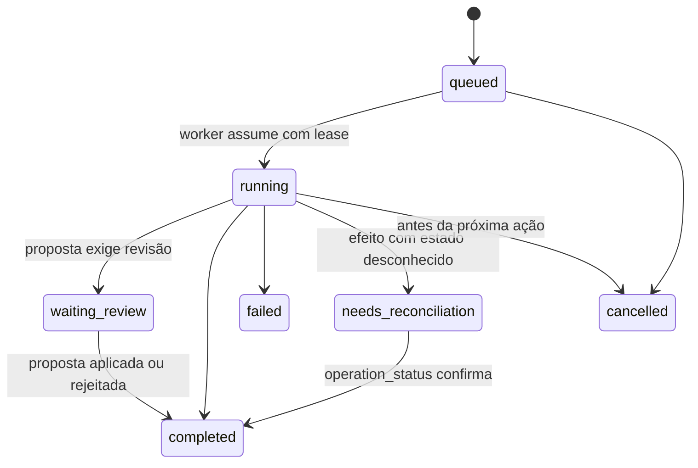

# Spec de implementação: plataforma de IA v1

**Contrato de referência:** [ai-platform-v1.md](../contracts/ai-platform-v1.md).
**Estado:** implementação local parcial em 01/10/2026; fatia vertical de leitura integrada, nada ativado em produção.
A montagem em `platform.py` e as cinco rotas de status/execuções da seção 4 estão implementadas.
Rotas de propostas, operações e grants e `backend/services/ai/benchmark/` permanecem como **desenho**, sem implementação HTTP.
O estado e as evidências de cada parte estão no [runbook](../runbooks/ai-platform.md).
O teste opt-in de oito perguntas com Ollama real existe em
`backend/tests/ai/test_ai_ollama_local_read.py`; o candidato Qwen foi reprovado
no perfil local testado. [Resultado](../validation/ai-ollama-read-2026-10-01.md).
**Objetivo deste documento:** detalhar, de forma verificável, como o contrato foi
traduzido em código: módulos, API HTTP, estados e regras que os testes cobrem.
Quando este documento e o contrato divergirem, vale o contrato.

## 1. Mapa de módulos

| Caminho | Papel |
| --- | --- |
| `backend/database/migrations_v2/0002_ai_platform.sql` | Espaços financeiros, grants, execuções, checkpoints, quarentena, propostas, operações, outbox, orçamento, RAG e RLS |
| `backend/services/ai/errors.py` | Erros com `code`, `retryable`, `safe_message`, `trace_id` |
| `backend/services/ai/settings.py` | Flags e limites lidos do ambiente |
| `backend/services/ai/types.py` | `ExecutionContext`, `Fact`, `Source`, dinheiro como string decimal |
| `backend/services/ai/db.py` | `scoped_tx` (escopo de tenant + RLS), auditoria e outbox |
| `backend/services/ai/scope.py` | Contexto autenticado resolvido no servidor |
| `backend/services/ai/policy.py` | Modos `observe/assisted/delegated` e grants revogáveis |
| `backend/services/ai/registry.py` | Registro versionado de ferramentas e schemas |
| `backend/services/ai/gateway/` | Registro de modelos, seleção, orçamento, circuito, failover, adaptadores |
| `backend/services/ai/finance/` | Consultas enumeradas, propostas, operações idempotentes, reversão |
| `backend/services/ai/email/`, `artifacts.py`, `imports/` | Conector de e-mail substituível, quarentena e prévia de importação |
| `backend/services/ai/runs.py`, `orchestrator.py`, `worker.py` | Estados persistentes, checkpoints, cancelamento e fila com lease |
| `backend/services/ai/rag.py` | RAG lexical com isolamento por espaço e ACL |
| `backend/services/ai/platform.py` | Montagem das dependências (nada é criado no import) |
| `backend/routes/ai.py` | API `/api/ai/v1` |
| `backend/services/ai/benchmark/` | Casos sintéticos e executor de homologação |
| `frontend/src/components/ai/` | Tela do operador |

## 2. Identidade e escopo

- A API usa a sessão V2 (`require_v2_session`) e exige `X-CSRF-Token` em todo
  `POST`. Sem sessão: `401 unauthorized`.
- O servidor resolve `tenant_id` (membership; `X-Tenant-Id` só seleciona entre os
  tenants do usuário), `financial_space_id` (o corpo pode **escolher** entre os
  espaços de que o usuário é membro; qualquer outro valor responde `404`) e as
  contas permitidas (vínculo `financial_space_accounts`).
- Conta ou conta a pagar sem vínculo com um espaço fica fora do alcance da IA.
- Toda transação da plataforma define `app.tenant_id`; as tabelas novas têm RLS
  com `FORCE`. Papéis `SUPERUSER`/`BYPASSRLS` ignoram RLS: a aplicação deve usar
  um papel comum.

## 3. Autonomia

| Modo | Leitura e prévia | `finance.prepare_change` | `finance.apply_change` / `reverse_change` |
| --- | --- | --- | --- |
| `observe` | sim, se a capacidade constar do grant | sim | negado |
| `assisted` | sim | sim | somente proposta com aprovação específica (hash + versão) |
| `delegated` | sim | sim | automático dentro das restrições do grant; fora delas volta para revisão |

- Sem grant ativo com a capacidade, a ferramenta é negada (`capability_denied`).
- Modo delegado exige decisão explícita de valor: `amount_limit` ou
  `amount_unlimited = true`.
- O grant é travado e revalidado dentro da transação do efeito.
- Proposta cuja única evidência é comprovante (imagem/PDF/WhatsApp) é marcada
  `requires_review` e nunca é aplicada por grant: a Fase 1 continua sem baixa
  automática.
- Grants são criados e revogados só pela API administrativa. Nenhuma ferramenta
  do modelo altera grants.

## 4. API HTTP (`/api/ai/v1`)

Todas as respostas de erro: `{"error": {"code", "retryable", "safe_message", "trace_id"}}`.

Na fatia entregue, corpos JSON têm limite de 64 KiB e propriedades extras são
recusadas. As respostas das cinco rotas incluem `X-Trace-Id` e
`Cache-Control: no-store`. A listagem devolve `{runs, next_cursor}`. O trace da
execução permanece estável nos reenvios; o cabeçalho identifica cada requisição
HTTP. `POST /runs` aceita somente `local_only` nesta etapa, conforme o cliente
atual. Nenhuma flag é ligada pela montagem ou pelos testes.

| Método e rota | Semântica |
| --- | --- |
| `GET /status` | Disponibilidade, flags, espaços do usuário e capacidades autorizadas. Nunca `401` por IA desligada: com `AI_ENABLED=false` responde `200` com `enabled: false` |
| `POST /runs` | `202` com `run_id`. Aceita `Idempotency-Key`; mesma chave e mesmo corpo devolvem a execução anterior; corpo diferente devolve `409 conflict` |
| `GET /runs` | Execuções recentes do ator no espaço (cursor opaco) |
| `GET /runs/{id}` | Estado, progresso, fatos, fontes, propostas, operações, avisos e erro |
| `POST /runs/{id}/cancel` | Solicita cancelamento; efeito já confirmado permanece |
| `GET /proposals/{id}` | Prévia, efeito antes/depois, ambiguidades, evidências, hash e versão |
| `POST /proposals/{id}/approve` | Corpo `{payload_hash, version}`; agenda a execução (`202` com `run_id`) |
| `POST /proposals/{id}/reject` | Corpo `{reason}`; proposta vira `rejected` |
| `GET /operations/{id}` | Estado e efeito confirmado (rastreio) |
| `POST /operations/{id}/reverse` | Corpo `{reason}`; cria proposta de compensação (`201`) |
| `GET /grants`, `POST /grants`, `POST /grants/{id}/revoke` | Administração de grants pelo titular do espaço |

Códigos: `400` schema inválido, `401` sem sessão, `403` capacidade negada ou
CSRF, `404` recurso fora de escopo, `409` versão/idempotência, `413` tamanho,
`429` limite, `503` IA desativada ou indisponível.

### 4.1 `POST /runs`

```json
{
  "task": "finance_question",
  "message": "Quanto falta pagar das contas de outubro?",
  "financial_space_id": "uuid (opcional se houver um único espaço)",
  "privacy": "local_only",
  "input_refs": []
}
```

`task`: `finance_question` | `statement_import`. As tarefas `apply_proposal` e
`reverse_operation` são criadas pelo servidor (aprovação e reversão), nunca
pedidas diretamente. `privacy` padrão: `local_only`.

Resposta `202`: `{"run_id", "status": "queued", "trace_id"}`.

### 4.2 `GET /runs/{id}`

```json
{
  "run_id": "uuid",
  "status": "queued|running|waiting_review|completed|failed|cancelled|needs_reconciliation",
  "task": "finance_question",
  "contract_version": "1.1.0",
  "trace_id": "uuid",
  "created_at": "2026-10-01T12:00:00Z",
  "finished_at": null,
  "cancel_requested": false,
  "scope": {
    "financial_space": {"id": "uuid", "name": "Pessoal", "kind": "personal"},
    "accounts": [{"id": "uuid", "name": "Conta pessoal"}]
  },
  "progress": {
    "stage": "searching|reading|preparing|waiting_review|applying|done",
    "steps": [
      {"seq": 1, "kind": "tool", "name": "finance.read", "label": "Consultando contas a pagar",
       "status": "succeeded", "started_at": "...", "finished_at": "..."}
    ]
  },
  "summary_pt_br": "texto",
  "facts": [
    {"key": "payables.remaining", "label": "Falta pagar", "value": "1250.00", "unit": "money",
     "currency": "BRL", "period": {"kind": "month", "start": "2026-10-01", "end": "2026-10-31", "label": "outubro/2026"},
     "scope": {"financial_space_id": "uuid", "kind": "personal", "declared": "competência mensal"},
     "source_refs": ["sql:payables:2026-10"], "as_of": "2026-10-01T12:00:03Z",
     "missing_reason": null, "confidence": null}
  ],
  "sources": [{"ref": "sql:payables:2026-10", "kind": "sql", "label": "Contas a pagar de outubro/2026", "as_of": "...", "extra": {}}],
  "proposal_ids": [],
  "operation_ids": [],
  "warnings": [],
  "model": {"alias": "local-...", "provider": "ollama", "fallback_used": false},
  "error": null
}
```

Ausência de dado é `value: null` com `missing_reason`; nunca zero.

### 4.3 `GET /proposals/{id}`

```json
{
  "proposal_id": "uuid",
  "kind": "payable_payment|statement_import|reverse_operation",
  "status": "draft|ready|approved|applied|rejected|expired|stale",
  "version": 1,
  "payload_hash": "sha256 hex",
  "requires_review": false,
  "expires_at": "...",
  "summary_pt_br": "texto gerado pelo backend",
  "origin": {"source_kind": "email|upload|whatsapp|manual", "label": "extrato-setembro.ofx", "period": {"start": "...", "end": "..."}},
  "scope": {"financial_space": {"id": "uuid", "name": "Pessoal", "kind": "personal"}, "accounts": [{"id": "uuid", "name": "..."}]},
  "effect": {
    "state_after": "registrado_pago|conciliado|importado",
    "before": {"paid": "0.00", "remaining": "300.00", "status": "pending"},
    "after": {"paid": "100.00", "remaining": "200.00", "status": "partial"},
    "items_new": 0, "items_duplicate": 0, "totals": {}
  },
  "ambiguities": [{"code": "transfer_without_destination", "message": "..."}],
  "evidence": [{"kind": "ofx_transaction|receipt|email|manual", "ref": "..."}],
  "operation_id": null,
  "run_id": "uuid"
}
```

Estados exibidos ao titular, sempre distintos:

- **conferido**: evidência revisada (ex.: comprovante da Fase 1). Não é baixa.
- **registrado pago**: pagamento lançado em `payable_payments` sem vínculo com
  extrato.
- **conciliado no extrato**: pagamento vinculado a uma transação vinda de OFX.

## 5. Estados



Proposta: `draft → ready → approved → applied`, ou `rejected/expired/stale`.
Expira em 24 h. Mudança nos alvos invalida a versão (`stale`).

## 6. Idempotência e recuperação

- Chave de operação = SHA-256 de escopo + fonte + tipo + identidade estável da
  ação, sempre calculada pelo backend.
- `ai_operations` tem índice único `(tenant_id, operation_key)`. A linha de
  operação, o efeito financeiro, a auditoria e o outbox são gravados na mesma
  transação.
- O id da operação é determinístico (UUIDv5 da chave): depois de um timeout, o
  executor consulta `finance.operation_status` antes de qualquer nova tentativa.
- Cada etapa de uma execução tem `step_key`. Etapa concluída é reutilizada após
  reinício do worker ou troca de provedor; nunca reexecutada.
- Entrega do outbox pode se repetir; `dedup_key` impede duplicar a notificação e
  a reentrega nunca refaz o efeito.

## 7. Gateway

- Um adaptador faz uma única tentativa por chamada. Retentativas e troca de rota
  são só do gateway.
- Seleção: classe da tarefa → capacidades exigidas (tools/JSON/visão) →
  privacidade → estado `approved` → propósito (leitura/escrita) → prioridade →
  orçamento.
- `local_only` nunca usa rota externa. `cloud_redacted` só usa rota externa com
  redução verificada.
- Timeout/rede/429/5xx: próxima rota compatível (respeita `Retry-After`).
  401/403: suspende a credencial e segue por rota autorizada. JSON inválido: uma
  correção dentro do orçamento; nova falha muda de rota. Recusa, ambiguidade e
  falha de regra não trocam de rota.
- Limites iniciais: 3 inferências por etapa, 8 ferramentas por execução, 60 s por
  inferência, 180 s por execução interativa. Três falhas transitórias em 60 s
  abrem o circuito por 60 s; uma sonda decide reabrir.
- Custo: teto por execução, dia e mês; zero bloqueia gasto externo; custo
  desconhecido bloqueia a rota paga; a reserva é atômica.

## 8. E-mail, anexos e importação

- Interface única: `search`, `get_message`, `download_attachment`. Não existe
  operação de enviar, apagar ou alterar mensagens.
- O conector `mcp_http` só chama ferramentas de uma lista de permissão
  configurada; ferramentas extras do servidor são ignoradas.
- Credenciais ficam em um cofre referenciado por `credential_ref`; o modelo, os
  resultados de ferramenta, a auditoria e os logs não recebem token.
- Arquivo: até 20 MiB, tipo detectado pelo conteúdo, SHA-256, quarentena privada
  por 7 dias, nome original só no banco.
- A prévia de OFX usa `OfxImportPipeline.process_file`, o mesmo código do
  importador do produto.
- Deduplicação por arquivo (SHA-256 no espaço) e por identidade financeira
  (FITID + conta, `dedup_key`).
- Texto de e-mail, PDF, OCR e resultado MCP é dado não confiável.

## 9. Critérios de aceite

Os testes ficam em `backend/tests/ai/` (um arquivo por área) e
`frontend/src/components/ai/`. O mapeamento AC → teste e o resultado da última
execução estão em [docs/runbooks/ai-platform.md](../runbooks/ai-platform.md).
