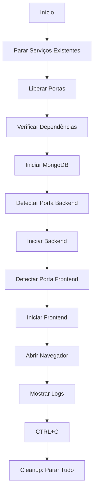

# ✅ Melhorias no alca_start_mac.sh

## O Que Foi Feito

### 🎯 Problema Resolvido
O script agora **para todos os serviços antes de iniciar** e detecta automaticamente as portas corretas.

---

## 🔧 Mudanças Implementadas

### 1. **Parar Serviços Existentes** (NOVO)

Antes de iniciar qualquer coisa, o script agora:

```bash
✅ Para processos anteriores (via PIDs salvos)
✅ Libera portas ocupadas (3000, 5000, 5173, 8001)
✅ Aguarda 2 segundos para as portas liberarem
```

**Implementação:**
```bash
# Parar PIDs salvos
if [ -f ".frontend.pid" ]; then
    kill $(cat .frontend.pid)
fi

# Liberar portas
for PORT in 3000 5000 5173 8001; do
    lsof -ti:$PORT | xargs kill -9
done
```

### 2. **Detecção Inteligente de Portas**

O script agora detecta automaticamente portas disponíveis:

**Backend:**
- ✅ Preferência: porta **5000**
- ✅ Fallback: porta **8001** (se 5000 ocupada)

**Frontend:**
- ✅ Preferência: porta **3000**
- ✅ Fallback: porta **5173** (Vite padrão)

**Implementação:**
```bash
# Backend
BACKEND_PORT=5000
if lsof -Pi :5000 -sTCP:LISTEN -t >/dev/null; then
    BACKEND_PORT=8001
fi
export PORT=$BACKEND_PORT

# Frontend
FRONTEND_PORT=3000
if lsof -Pi :3000 -sTCP:LISTEN -t >/dev/null; then
    FRONTEND_PORT=5173
fi
```

### 3. **Output Melhorado com Cores**

Agora o script mostra informações coloridas:

```
🚀 Alça Finanças - Iniciando...

🛑 Parando serviços existentes...
  🛑 Parando Frontend (PID: 12345)
  🛑 Parando Backend (PID: 67890)
  🔍 Verificando portas...
✅ Serviços anteriores parados

✅ Backend irá iniciar na porta 5000
✅ Frontend irá iniciar na porta 3000

━━━━━━━━━━━━━━━━━━━━━━━━━━━━━━━━
✅ Alça Finanças está rodando!
━━━━━━━━━━━━━━━━━━━━━━━━━━━━━━━━

📍 URLs:
   🌐 Frontend:  http://localhost:3000
   🔧 Backend:   http://localhost:5000
   🗄️  MongoDB:   mongodb://localhost:27017

📝 Logs:
   Backend:  logs/backend-20251115-123456.log
   Frontend: logs/frontend-20251115-123456.log
```

### 4. **Verificação Robusta do Frontend**

O script agora:
- ✅ Tenta detectar o frontend em **ambas** as portas (3000 e 5173)
- ✅ Aguarda até 40 segundos (aumentado de 30)
- ✅ Mostra últimas 20 linhas do log em caso de erro

### 5. **Mensagens de Erro Melhoradas**

Se algo falhar, o script mostra:
- ❌ Mensagem de erro clara e colorida
- 📝 Localização dos logs
- 📋 Últimas linhas do log para debug

---

## 🎯 Como Usar

### Uso Normal

```bash
./alca_start_mac.sh
```

**O que acontece:**
1. 🛑 Para todos os serviços existentes
2. 🔍 Libera portas necessárias
3. 🗄️ Verifica/inicia MongoDB
4. 🔧 Inicia Backend (porta 5000 ou 8001)
5. 🎨 Inicia Frontend (porta 3000 ou 5173)
6. 🌐 Abre navegador automaticamente
7. 📝 Mostra logs em tempo real

### Parar Tudo

Pressione `CTRL+C` no terminal onde o script está rodando.

**O que acontece:**
- 🛑 Para Frontend
- 🛑 Para Backend
- 🛑 Para MongoDB (se foi iniciado pelo script)
- 🧹 Remove arquivos PID

---

## 🔄 Comparação: Antes vs Depois

### Antes ❌

```bash
./alca_start_mac.sh
# ❌ Erro: porta 3000 já está em uso
# ❌ Erro: porta 5000 já está em uso
# 🤷 Tinha que matar processos manualmente
```

### Depois ✅

```bash
./alca_start_mac.sh
# ✅ Parando serviços existentes...
# ✅ Liberando porta 3000
# ✅ Liberando porta 5000
# ✅ Backend iniciando na porta 5000
# ✅ Frontend iniciando na porta 3000
# 🎉 Tudo funcionando!
```

---

## 📊 Fluxo do Script



---

## 🐛 Debugging

### Ver o que está ocupando as portas

```bash
# Porta 3000
lsof -i :3000

# Porta 5000
lsof -i :5000

# Todas as portas do Alça
lsof -i :3000 -i :5000 -i :5173 -i :8001
```

### Ver processos do Python/Node

```bash
# Python
ps aux | grep "python.*app.py"

# Node/Vite
ps aux | grep "node.*vite"
```

### Matar processos manualmente

```bash
# Por porta
kill -9 $(lsof -ti:3000)
kill -9 $(lsof -ti:5000)

# Por PID salvo
kill $(cat .frontend.pid)
kill $(cat .backend.pid)
```

### Ver logs

```bash
# Últimos logs
ls -lt logs/ | head -5

# Seguir logs em tempo real
tail -f logs/backend-*.log
tail -f logs/frontend-*.log

# Ver erros no backend
grep -i error logs/backend-*.log

# Ver erros no frontend
grep -i error logs/frontend-*.log
```

---

## 🎯 Casos de Uso

### Caso 1: Tudo Limpo (Primeira Vez)

```bash
./alca_start_mac.sh
# ✅ Nenhum serviço para parar
# ✅ Portas livres
# ✅ Backend na porta 5000
# ✅ Frontend na porta 3000
```

### Caso 2: Serviços Já Rodando

```bash
./alca_start_mac.sh
# ✅ Parando Frontend (PID: 1234)
# ✅ Parando Backend (PID: 5678)
# ✅ Liberando portas
# ✅ Reiniciando tudo
```

### Caso 3: Portas Ocupadas por Outros Apps

```bash
./alca_start_mac.sh
# ⚠️  Porta 5000 ocupada, usando 8001
# ⚠️  Porta 3000 ocupada, usando 5173
# ✅ Backend na porta 8001
# ✅ Frontend na porta 5173
```

### Caso 4: Algo Falhou

```bash
./alca_start_mac.sh
# ❌ Frontend não está respondendo
# 📝 Verifique os logs: logs/frontend-20251115-123456.log
# 📋 Últimas linhas:
#    [error] Failed to start server
#    [error] Port 3000 is in use
```

---

## ✅ Checklist de Funcionamento

Após executar o script, verifique:

- [ ] Backend responde: `curl http://localhost:5000/api/health`
- [ ] Frontend abre: http://localhost:3000
- [ ] MongoDB conecta: `mongosh --eval "db.adminCommand('ping')"`
- [ ] Logs estão sendo gerados: `ls -la logs/`
- [ ] PIDs salvos: `ls -la .*.pid`

---

## 🔧 Troubleshooting

### Problema: "Port already in use"

**Solução:** O script agora resolve automaticamente! Ele vai:
1. Detectar a porta ocupada
2. Usar porta alternativa
3. Informar qual porta está sendo usada

### Problema: "Frontend não responde"

**Verificar:**
```bash
# Ver log do frontend
tail -50 logs/frontend-*.log

# Verificar se Vite está rodando
ps aux | grep vite

# Testar manualmente
cd frontend
npm run dev
```

### Problema: "Backend não responde"

**Verificar:**
```bash
# Ver log do backend
tail -50 logs/backend-*.log

# Verificar se Python está rodando
ps aux | grep "python.*app.py"

# Testar manualmente
cd backend
source .venv/bin/activate
python app.py
```

---

## 📝 Variáveis de Ambiente

O script usa estas variáveis (pode customizar):

```bash
# Backend
PORT=5000                    # Porta do backend (5000 ou 8001)
HOST=0.0.0.0                # Host do backend
MONGO_URI=mongodb://...     # URI do MongoDB

# Frontend
REACT_APP_BACKEND_URL=...   # URL do backend para frontend
CORS_ORIGINS=...            # Origens permitidas no CORS
```

Para customizar, crie um `.env` no diretório `backend/`:

```bash
cd backend
cat > .env << EOF
PORT=5001
MONGO_URI=mongodb://localhost:27017/meu_db
EOF
```

---

## 🎉 Resultado

Agora você pode executar `./alca_start_mac.sh` quantas vezes quiser sem se preocupar com:
- ✅ Portas ocupadas
- ✅ Processos antigos rodando
- ✅ Conflitos de porta
- ✅ Ter que matar processos manualmente

**É só executar e usar! 🚀**
