# Architecture Overview — Alça Finanças

**Last Updated:** 2026-02-27
**Architect:** Skills System Team
**Status:** Active

---

## Table of Contents

1. [Big Picture](#big-picture)
2. [System Context](#system-context)
3. [Container Diagram](#container-diagram)
4. [Data Flow](#data-flow)
5. [Security Flow](#security-flow)
6. [Deployment Architecture](#deployment-architecture)
7. [Sequence Diagrams](#sequence-diagrams)

---

## Big Picture

**Alça Finanças** is a personal finance SaaS platform built as a **modular monolith** with clear skill boundaries, enabling future extraction into microservices.

### Key Characteristics
- **Single-Tenant Today:** Each user has isolated data via `user_id` filtering
- **Multi-Tenant Ready:** Database schema and RLS designed for multi-tenancy
- **Skills-Based:** Logical boundaries enable independent evolution
- **Cloud-Native:** Containerized, stateless, horizontally scalable

### Technology Stack
- **Backend:** Python 3.9+, Flask 3.0, Supabase (PostgreSQL)
- **Frontend:** React 18, TypeScript, Vite, Tailwind CSS
- **Database:** Supabase PostgreSQL with Row Level Security (RLS)
- **Auth:** JWT + bcrypt (custom) OR Supabase Auth, OAuth (Google)
- **Infrastructure:** Docker, Docker Compose, Nginx/Traefik, GitHub Actions
- **Domain:** alcahub.cloud
- **VPS:** Ubuntu 24.04

---

## System Context

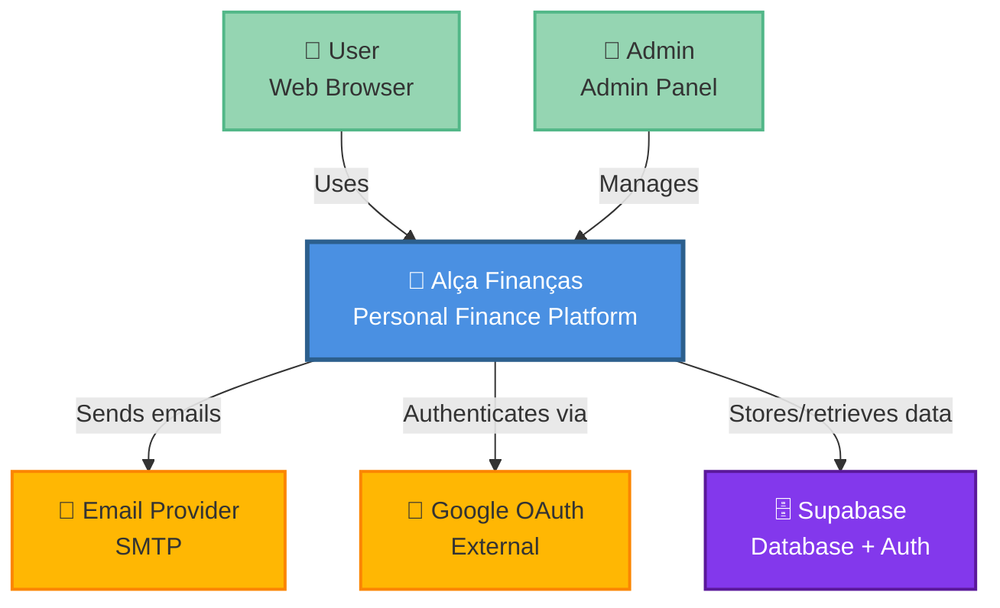

### External Systems
- **Supabase:** PostgreSQL database + Auth service
- **Google OAuth:** Social login
- **Email Provider:** Password recovery, notifications (SMTP)

### Users
- **End Users:** Manage personal finances
- **Admins:** Manage users, view logs, system stats

---

## Container Diagram

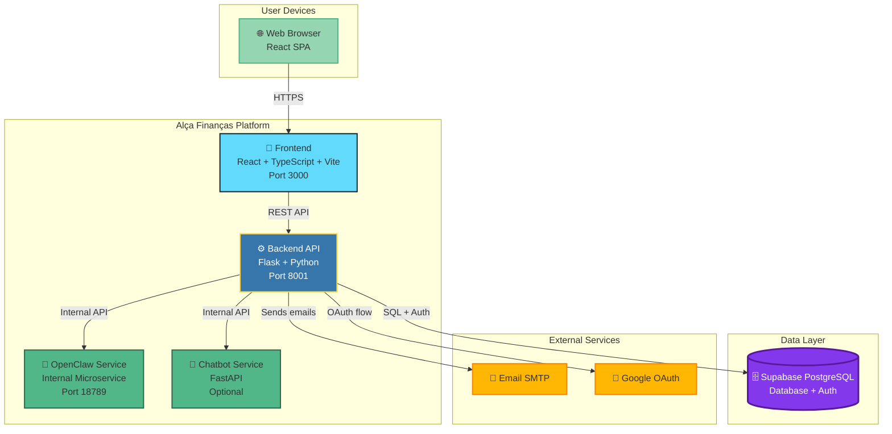

### Containers

| Container | Technology | Purpose | Port |
|-----------|-----------|---------|------|
| **Frontend** | React 18 + Vite | Single-page application | 3000 |
| **Backend API** | Flask 3.0 | REST API, business logic | 8001 |
| **OpenClaw** | Python microservice | Internal automation | 18789 |
| **Chatbot** | FastAPI | AI chatbot (optional) | TBD |
| **Database** | Supabase PostgreSQL | Data persistence + Auth | External |

---

## Data Flow

### User Request Flow

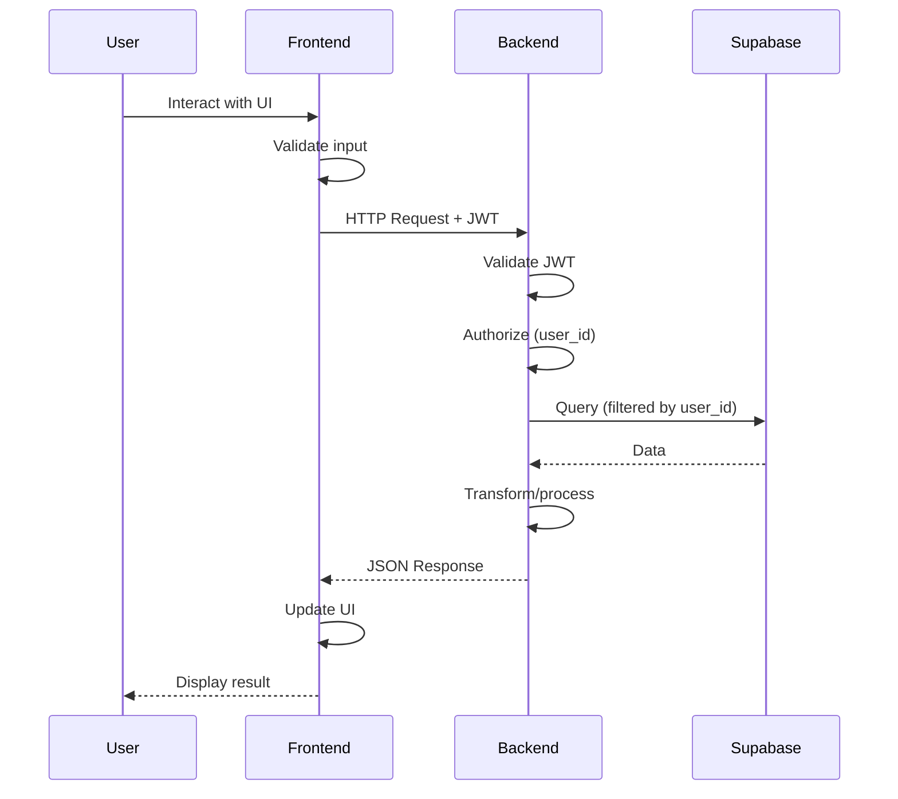

### Key Points
1. **Frontend validates:** Client-side validation for UX
2. **Backend validates:** Server-side validation for security
3. **Authorization:** All queries filtered by `user_id` from JWT
4. **Transformation:** Business logic in backend services
5. **Stateless:** No session state on backend (JWT-based)

---

## Security Flow

### Authentication Flow (JWT)

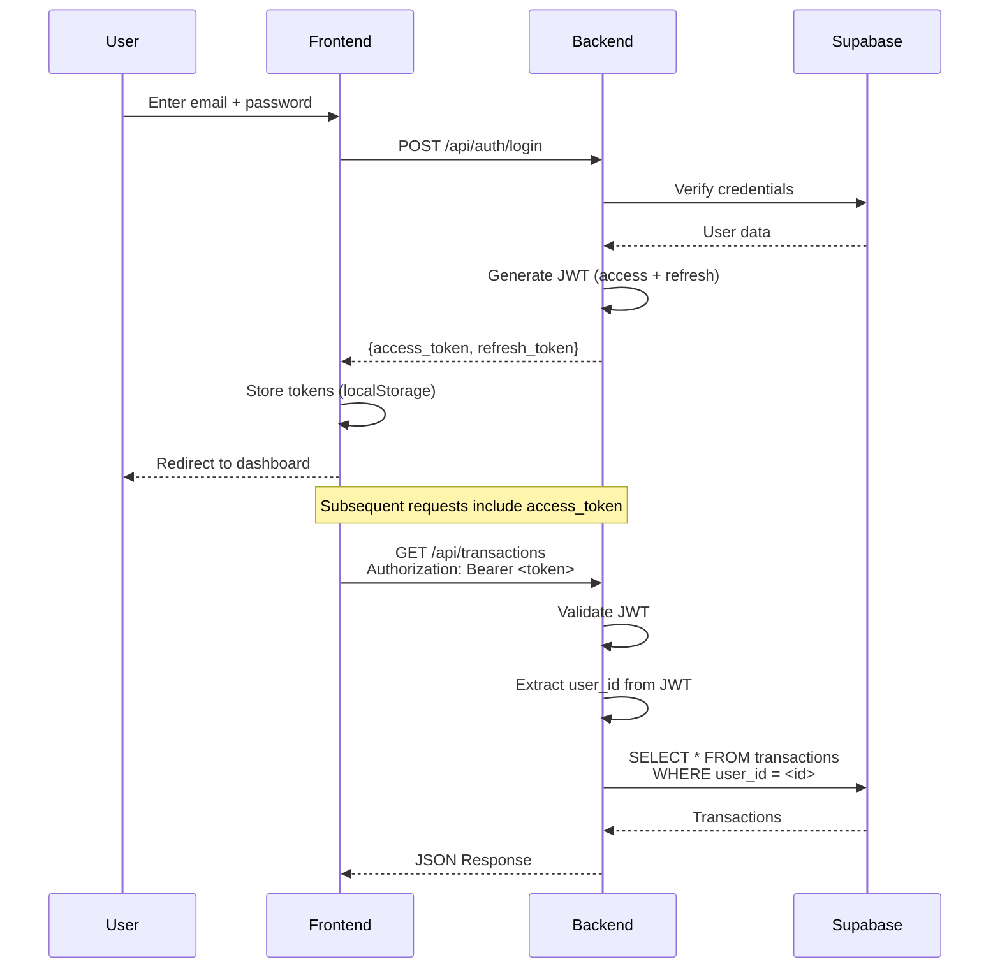

### Authorization Layers

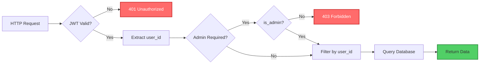

### Security Layers
1. **Network:** HTTPS/TLS (production)
2. **Authentication:** JWT validation
3. **Authorization:** User-level filtering, admin role checks
4. **Input Validation:** Pydantic schemas
5. **Output Encoding:** JSON serialization
6. **Database:** RLS policies (backend bypasses with service_role)
7. **Rate Limiting:** Flask-Limiter on critical endpoints

---

## Deployment Architecture

### Production Deployment (VPS)

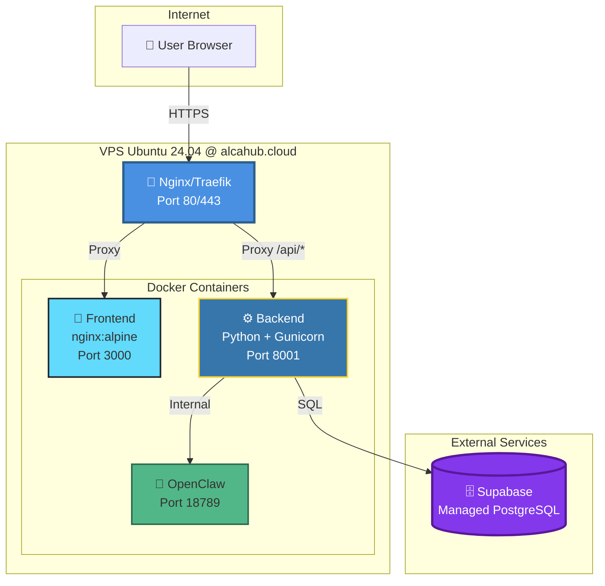

### CI/CD Pipeline

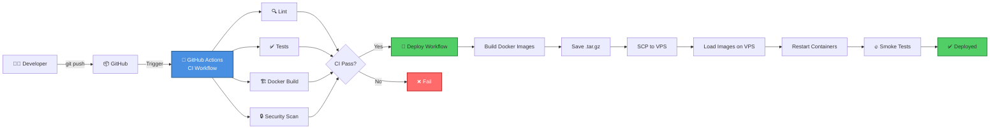

---

## Sequence Diagrams

### User Journey: Login

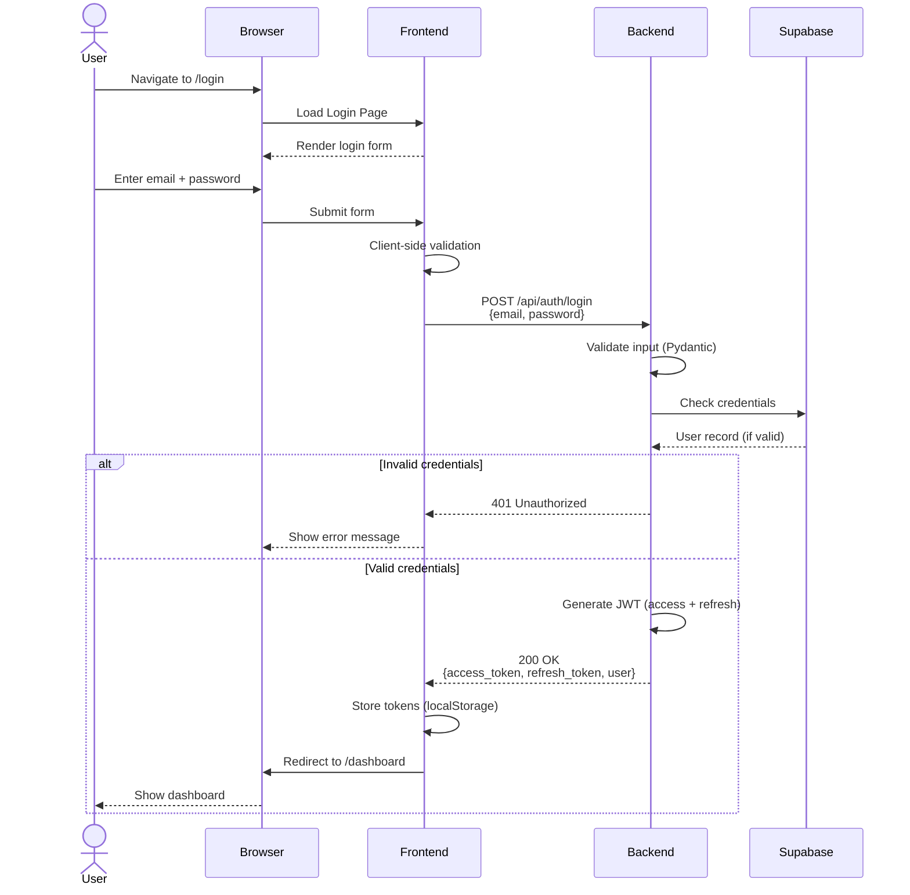

### User Journey: Create Transaction

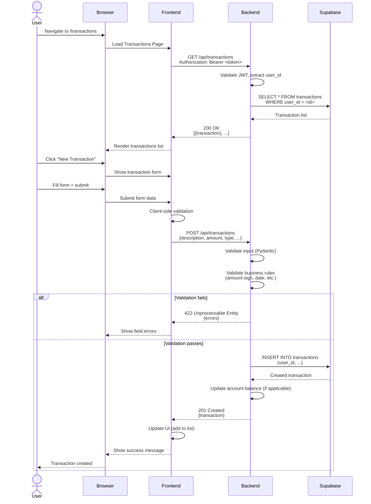

### Admin Journey: View User Details

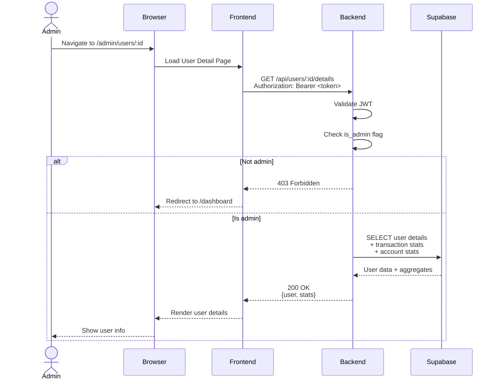

### CSV Import Flow

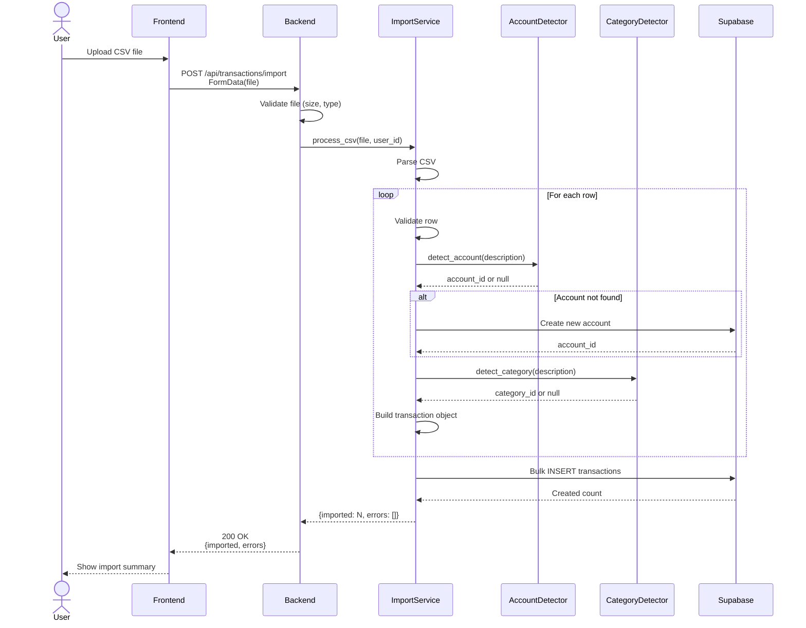

---

## Component Architecture

### Backend Layers

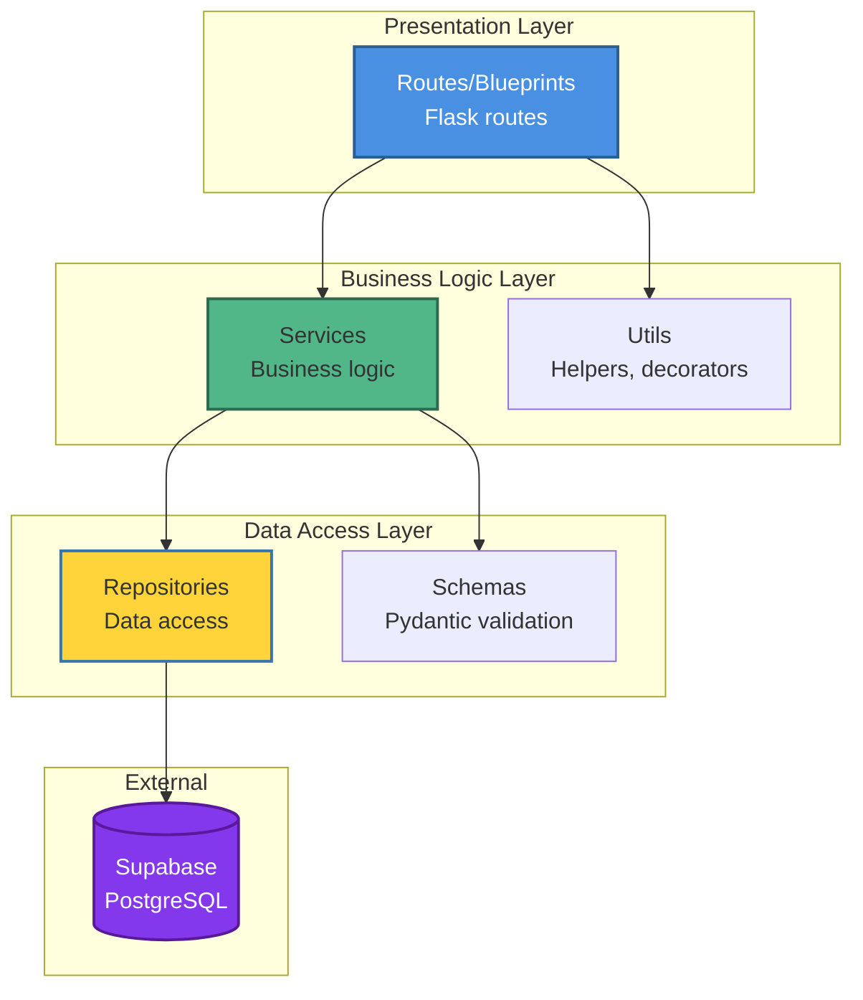

### Frontend Architecture

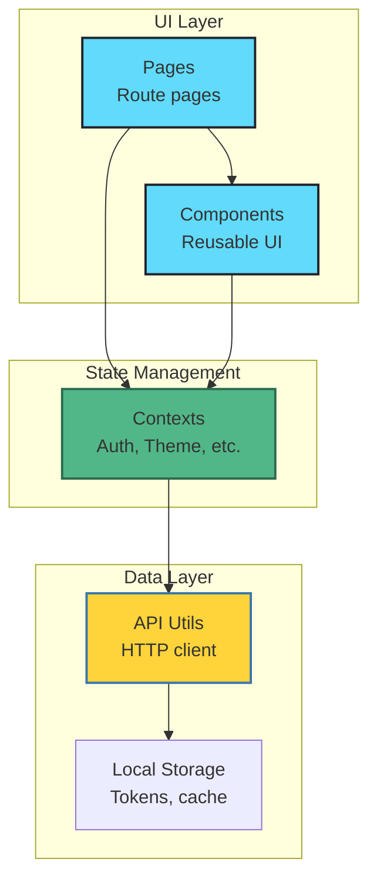

---

## Technology Decisions

### Why Flask?
- Lightweight, flexible
- Mature ecosystem
- Easy to modularize with Blueprints
- Good for MVP and iterative development

### Why React?
- Component-based architecture
- Rich ecosystem
- TypeScript support
- Good developer experience

### Why Supabase?
- Managed PostgreSQL (no ops overhead)
- Built-in Auth
- Row Level Security
- Real-time subscriptions (future)
- Generous free tier

### Why Monolith (not microservices)?
- **Simplicity:** Single codebase, single deployment
- **Velocity:** Faster development, no inter-service communication overhead
- **Cost:** Lower infrastructure costs
- **Future-ready:** Skills architecture enables extraction when needed

---

## Scalability Considerations

### Current Bottlenecks
1. **Database:** Single Supabase instance (mitigated by managed service)
2. **Backend:** Single VPS instance (can scale horizontally)
3. **Frontend:** Static files (can use CDN)

### Scaling Strategy

#### Vertical Scaling (Phase 1)
- Upgrade VPS resources (CPU, RAM)
- Optimize database queries, add indexes
- Add Redis cache for frequently accessed data

#### Horizontal Scaling (Phase 2)
- Deploy multiple backend instances behind load balancer
- Use CDN for frontend static assets
- Read replicas for database (Supabase supports)

#### Service Extraction (Phase 3)
- Extract high-traffic skills into microservices:
  - `authentication` → Auth Service
  - `transactions` → Transactions Service
  - `reports` → Reports Service (async processing)
- Use message queue (RabbitMQ, Kafka) for async communication
- Implement API gateway

---

## Observability

### Monitoring Stack (Planned)
- **Logs:** Structured JSON logs → CloudWatch / Loki
- **Metrics:** Prometheus + Grafana
- **Traces:** OpenTelemetry → Jaeger / Tempo
- **Alerts:** Alertmanager → Slack / PagerDuty
- **Uptime:** UptimeRobot / Pingdom

### Key Dashboards
1. **System Health:** CPU, memory, disk, network
2. **API Performance:** Request rate, latency, error rate
3. **Business Metrics:** Transactions/day, users active, imports
4. **Security:** Failed auth attempts, rate limit hits

---

## Disaster Recovery

### Backup Strategy
- **Database:** Supabase automatic daily backups (7-day retention)
- **User Data Export:** `/api/auth/backup/export` endpoint
- **Recovery Time Objective (RTO):** <1 hour
- **Recovery Point Objective (RPO):** <24 hours

### Incident Response
1. **Detect:** Monitoring alerts
2. **Assess:** Check logs, metrics, traces
3. **Mitigate:** Rollback deployment, scale resources
4. **Resolve:** Fix root cause, deploy fix
5. **Postmortem:** Document incident, improve monitoring

---

## Future Architecture Vision

### Multi-Tenancy (Phase 4)
- Add `tenant_id` to all tables
- RLS policies filter by `tenant_id`
- Tenant-specific subdomains: `{tenant}.alcahub.cloud`
- Tenant management skill

### Real-Time Features (Phase 5)
- WebSockets via Supabase real-time
- Live transaction updates
- Collaborative budgeting

### Mobile App (Phase 6)
- React Native app (already scaffolded in `mobile/`)
- Shared API with web
- Offline-first with sync

---

**Next Review:** 2026-05-27 (Quarterly)

---

## References

- [Skills Registry](./SKILLS_REGISTRY.md)
- [Skills Dependency Graph](./SKILLS_DEPENDENCY_GRAPH.mmd)
- [Conventions](./CONVENTIONS.md)
- [ADR 0001: Skills Architecture](./ADRs/0001-skills-architecture.md)
