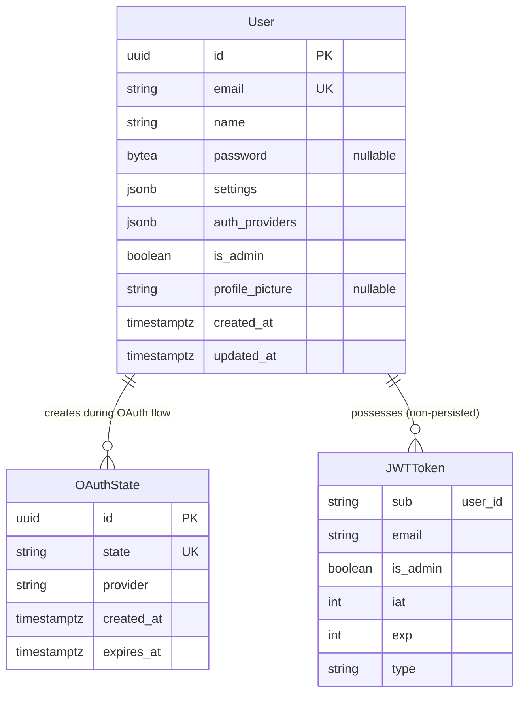

# Domain Model — authentication

## Entities

### User
- **Purpose:** Represents a registered user account
- **Identifier:** UUID `id`
- **Lifecycle States:** Active, Suspended (future), Deleted (soft delete, future)

**Attributes:**
- `email` — Unique email address (login identifier)
- `name` — Display name
- `password` — bcrypt hash (optional for OAuth-only users)
- `is_admin` — Admin flag
- `settings` — User preferences (JSONB)
- `auth_providers` — OAuth providers used (JSONB array)
- `profile_picture` — Avatar URL

### OAuth State
- **Purpose:** Temporary state for OAuth CSRF protection
- **Identifier:** UUID `id`
- **Lifecycle:** Created → Used/Expired → Deleted

**Attributes:**
- `state` — Random string (CSRF token)
- `provider` — OAuth provider name
- `expires_at` — Expiration timestamp (10 minutes)

### JWT Token (Non-Persisted)
- **Purpose:** Authentication token
- **Format:** JSON Web Token (JWT)

**Claims:**
- `sub` — User ID (UUID)
- `email` — User email
- `is_admin` — Admin flag
- `iat` — Issued at (timestamp)
- `exp` — Expires at (timestamp)
- `type` — Token type (access | refresh)

---

## Relationships



---

## Glossary

- **Authentication:** Verifying identity (who are you?)
- **Authorization:** Verifying permissions (what can you do?)
- **JWT (JSON Web Token):** Signed token containing user claims
- **Access Token:** Short-lived token (15 min) for API requests
- **Refresh Token:** Long-lived token (7 days) for obtaining new access tokens
- **OAuth:** Open Authorization protocol for third-party login
- **CSRF (Cross-Site Request Forgery):** Attack where attacker tricks user into executing unwanted actions
- **bcrypt:** Password hashing algorithm with adaptive cost
- **Salt:** Random data added to password before hashing
- **Cost Factor:** Number of hashing rounds (higher = slower, more secure)

---

## State Machines

### User Lifecycle (Current)

```
┌─────────┐
│ Created │
└────┬────┘
     │
     v
┌──────────┐
│  Active  │ <────── Current implementation
└──────────┘
```

### User Lifecycle (Future)

```
┌─────────┐
│ Created │
└────┬────┘
     │
     v
┌──────────┐      Violation      ┌───────────┐
│  Active  │ ─────────────────> │ Suspended │
└────┬─────┘                     └─────┬─────┘
     │                                 │
     │ Manual Delete           Reinstate
     v                                 │
┌──────────┐                           v
│ Deleted  │ <────────────────────────┘
└──────────┘
```

### OAuth Flow State

```
┌────────┐      Create State      ┌─────────┐
│ Start  │ ───────────────────> │ Pending │
└────────┘                       └────┬────┘
                                      │
                        ┌─────────────┴─────────────┐
                        │                           │
                   User Approves              User Denies / Expires
                        │                           │
                        v                           v
                  ┌──────────┐               ┌──────────┐
                  │ Callback │               │ Expired  │
                  └────┬─────┘               └──────────┘
                       │                            │
                  Exchange Code                  Delete
                       │                            │
                       v                            v
                  ┌─────────┐                 ┌────────┐
                  │ Success │                 │  End   │
                  └────┬────┘                 └────────┘
                       │
                  Delete State
                       │
                       v
                  ┌────────┐
                  │  End   │
                  └────────┘
```

---

## Domain Rules

1. **Email Uniqueness:** Each email can only have one active account
2. **Password XOR OAuth:** User must have either password OR OAuth provider (or both)
3. **Admin Escalation:** Only admins can grant admin privileges
4. **Token Expiry:** Access tokens expire after 15 minutes
5. **Refresh Token Single-Use:** (Future) Refresh tokens can only be used once
6. **OAuth State TTL:** OAuth states expire after 10 minutes
