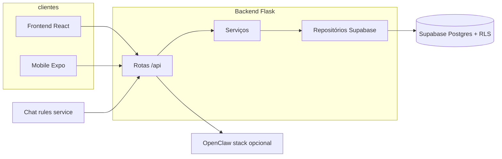

# System design — Alça Finanças

Documento de referência da arquitetura **tal como implementada** no repositório. Não descreve roadmap; detalhes de deploy pontual estão em `docs/` e `infra/README.md`.

## Problema que o sistema resolve

Pequenos times e pessoas físicas precisam **registrar e analisar movimentação financeira** (receitas/despesas) com **separação por organização (tenant)**, segurança no armazenamento (RLS) e uma API única consumida por web (e, em parte, mobile). O produto adiciona **visão de planejamento, metas, cartões, importação e canais de assistência** (chat) como extensões sobre o mesmo núcleo de dados.

## Arquitetura (visão lógica)

| Componente | Papel | Local no repo |
|------------|--------|----------------|
| **Frontend** | UI React, chama API com `Authorization: Bearer` (Supabase), variáveis `VITE_*` | `frontend/` |
| **Backend** | API REST Flask, autenticação/tenant, regras de negócio, acesso Supabase com service role + validação de app | `backend/app.py`, `backend/routes/`, `backend/services/`, `backend/repositories/` |
| **Supabase** | PostgreSQL, Auth, RLS, migrations | Projeto na nuvem; SQL em `supabase/migrations/` |
| **Chatbot (regras)** | Microserviço que usa JWT e chama a mesma API | `services/chatbot/` |
| **Chatbot (LLM / OpenClaw)** | Rota `/api/chatbot/*` no Flask → bridge → gateway OpenClaw | `backend/routes/chatbot.py`, `backend/services/openclaw_service.py`, `services/openclaw_bridge/`, `services/openclaw/` |
| **n8n** | Automações e webhooks (ex.: notificações, integrações); em geral operado no VPS, não como pasta de workflows neste repositório | `docs/N8N-VPS-SETUP.md`, `n8n/README.md` |
| **Mobile** | Cliente em React Native/Expo consumindo API | `mobile/` |

Não há container de Postgres no `docker-compose.yml` principal: o banco é o **Supabase gerenciado**.

## Fluxo de dados (simplificado)

1. O utilizador autentica-se via **Supabase Auth** (frontend); o token JWT é enviado ao Flask nas rotas `/api/...`.
2. O **backend** valida o token (incl. claims relevantes), resolve **tenant** e/orquestra serviços.
3. Os **repositórios** executam leitura/escrita no Postgres (via Supabase), com regras adicionais na aplicação; o RLS aplica-se conforme o papel e o desenho das policies.
4. **Relatórios, dashboard, importação** seguem a mesma cadeia: rota → service → repositório.
5. **Chatbot**: mensagens entram em rotas dedicadas; respostas podem depender de OpenClaw (rede interna Docker) ou de lógica em `services/chatbot`.

## Principais entidades (modelo de dados)

Definições canónicas estão nas migrations, em especial `20260303_000001_init.sql` e posteriores.

| Conceito | Descrição breve |
|----------|-----------------|
| **users** | Utilizadores da aplicação; alinhados ao fluxo de auth (incl. Supabase). |
| **tenants** | Organizações / espaços de trabalho (multi-tenant). |
| **tenant_members** | Ligação utilizador ↔ tenant com `role` (owner, admin, member, viewer). |
| **accounts** | Contas bancárias, cartões, etc., com `tenant_id`. |
| **categories** | Categorias de receita/despesa por tenant. |
| **transactions** | Movimentos financeiros ligados a conta/categoria. |
| **Objectivos (goals)** e **planejamento (planning)** | Módulos com migrations dedicadas (ex. `20260315000001_budget_plans.sql`, `20260317000001_goals_and_contributions.sql`). |
| **financial_expenses** | Despesas agendadas / recorrentes (ver `20260417000001_financial_expenses.sql`). |

Há tabelas auxiliares ( OAuth state, admin/audit, chatbot conversations, etc.) — ver migrations recentes com prefixo `202604*`.

## Integrações externas

- **Supabase**: Auth, database, eventualmente Realtime/Storage conforme evolução do produto.  
- **OpenClaw** (opcional): gateway + bridge para conversação LLM; variáveis `OPENCLAW_*` no compose.  
- **Google OAuth** (quando ativo): configurado no Flask (`authlib`) e documentado em `docs/CONFIGURAR-GOOGLE-OAUTH.md` e afins.  
- **n8n**: exposto tipicamente atrás de Nginx no VPS; webhooks podem chamar API ou serviços externos.  
- **CI**: GitHub Actions — lint/testes em `backend` e `frontend` nos caminhos definidos no workflow.

## Ficheiros de leitura recomendada

- `docs/00-overview/REPO-OPERATING-MODEL.md` — modelo operacional do repositório.  
- `docs/ENVIRONMENTS.md` — variáveis de ambiente.  
- `docs/04-database/tenancy.md` — tenência no banco.  
- `AGENTS.md` — papéis por pasta e linhas vermelhas.
